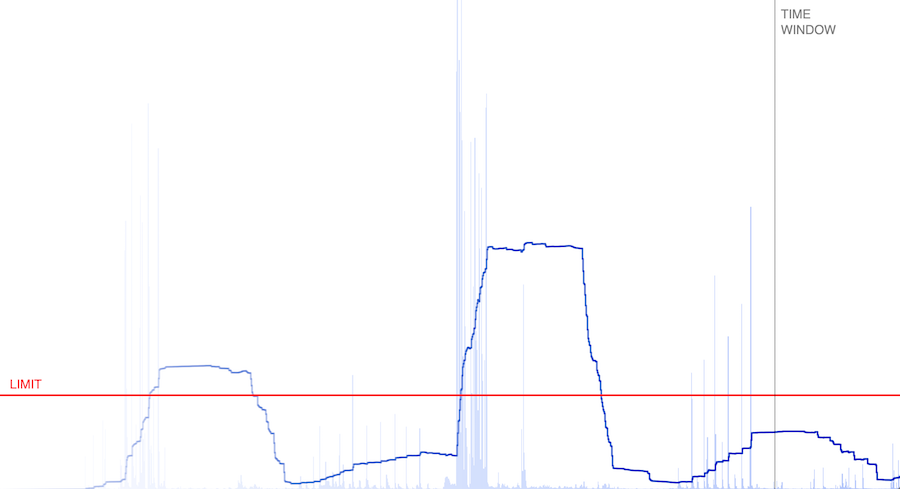

# Shut up

I created this tool to help my team stay quiet, so we won't disturb others.  
It calculated a moving average of the microphone's input level and alerts above a specified limit.  

## Usage
The tool is self-contained, there's no installation or compilation necessary. Just open `index.html` either from localhost or serve it through https (microphone access is blocked on http). The light blue graph shows the mic level, the dark blue line is the moving average of the last sample of levels over a given window of time, shown by the vertical black line. If the moving average surpasses the limit, shown by the horizontal red line, you get an alert. Then the average will have to decrease below the limit before the app will alert again.  

You can modify the limit by grabbing and moving the horizontal red line, or using the up/down keys.  
You can modify the time window by grabbing and moving the vertical black line, or using the left/right keys.  
You can pause and restart the app with the space key.  

Enjoy the silence!  

## Screenshot
  

## Not a screenshot
  
